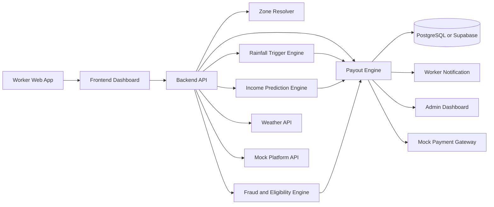

# ClaimEasy

**Zero-Claim Insurance for Gig Workers**

AI-powered parametric income protection for quick-commerce delivery workers.

## DEVTrails 2026 Submission

ClaimEasy is a **Guidewire DEVTrails 2026** project built for the official use-case: protect delivery partners from **loss of income caused by external disruptions** using AI, fraud detection, and automated parametric payouts.

### Submission Snapshot

- Hackathon phase: **Phase 1 - Ideation & Foundation**
- Current date context: **March 17, 2026**
- Phase 1 deadline: **March 20, 2026**
- Persona chosen: **quick-commerce delivery partners**
- Primary disruption for MVP: **rainfall**
- Platform choice: **web application**

## Why This Problem Matters

Delivery workers in India lose earnings when external disruptions reduce working hours or order volume. For quick-commerce riders, heavy rainfall can immediately cause:

- fewer fulfilled deliveries
- lower productive working time
- unsafe riding conditions
- income loss during peak demand windows

Traditional insurance does not work well here because it is claim-heavy, slow, and not designed for short-duration hyperlocal income shocks.

## Our Solution

ClaimEasy is a **weekly subscription-based parametric insurance platform** that automatically pays delivery workers when rainfall disrupts earning potential in their active zone.

Instead of asking workers to submit manual claims, the system:

- tracks the worker's active micro-zone
- checks rainfall in that zone
- estimates expected income for the current time slot
- validates eligibility using fraud and activity signals
- calculates payout automatically

## Why Judges Should Care

ClaimEasy is a strong hackathon concept because it is:

- **Relevant**: built for a real pain point in the gig economy
- **Insurance-native**: solves the exact host problem, loss of income only
- **AI-enabled**: uses prediction, scoring, and anomaly detection
- **Demo-friendly**: easy to show with simulated rainfall and instant payout logic
- **Scalable**: can later expand to more disruption types and real payment rails

## Official Constraint Fit

This solution is intentionally aligned with the host requirements.

- Coverage type: **loss of income only**
- Pricing model: **weekly**
- Persona: **delivery partners**
- AI-powered risk assessment: **included**
- Intelligent fraud detection: **included**
- Parametric automation: **included**
- Payout processing: **included**
- Health, life, accident, and vehicle coverage: **excluded**

## Persona

ClaimEasy focuses on **grocery and quick-commerce delivery riders**, especially workers on platforms such as **Zepto** and **Blinkit**.

This persona is a strong choice because:

- they operate in hyperlocal zones
- their earnings vary sharply by time of day
- rainfall directly affects mobility and order demand
- the weekly premium model fits their earning cycle

## Persona-Based Scenario

### Example Worker

- Name: Rakesh
- Role: Blinkit delivery rider
- Work zone: a dense quick-commerce micro-zone
- Peak earning window: 5pm-8pm

### Scenario

Rakesh logs in for his evening shift and is active in his assigned delivery zone. Heavy rainfall starts in that specific micro-zone during his peak earning hours. Because rainfall directly affects delivery speed, rider safety, and order completion, his expected earnings for that slot are disrupted.

Instead of asking Rakesh to file a claim, ClaimEasy:

- detects rainfall in his active zone
- checks whether the disruption crosses the payout threshold
- estimates his expected income for that time slot
- validates his eligibility using activity and fraud signals
- computes and records the payout automatically

This is the core workflow ClaimEasy is built around.

## Product Design

### Weekly Plans

| Plan | Weekly Premium | Coverage Limit |
| --- | ---: | ---: |
| Basic | Rs. 20 | Rs. 800 |
| Standard | Rs. 40 | Rs. 2000 |
| Pro | Rs. 60 | Rs. 4000 |

### How The Weekly Premium Model Works

ClaimEasy uses a weekly pricing model because gig workers typically think in short earning cycles rather than annual insurance cycles.

- workers subscribe once per week
- each plan has a fixed weekly premium and a fixed weekly coverage limit
- coverage resets on the next subscription cycle
- this structure is easier to understand, more affordable, and better aligned with gig-worker cash flow

In later phases, the fixed weekly premium can evolve into **dynamic weekly pricing** based on zone risk, disruption history, and worker behavior.

### Parametric Trigger

For the MVP, ClaimEasy uses **rainfall intensity** as the primary disruption trigger.

| Rainfall (mm/hr) | Severity | Payout Effect |
| --- | ---: | --- |
| 0-10 | 0% | No payout |
| 10-30 | 25% | Partial payout |
| 30-60 | 50% | Moderate payout |
| Above 60 | 100% | Full payout |

### Hyperlocal Logic

Claim decisions are made **per zone**, not per city.

- Area A has rain: workers in Area A may qualify
- Area B is dry: workers in Area B should not qualify

### Time-Based Income Logic

Worker earnings are not flat across the day, so ClaimEasy uses time-slot-based expected income.

Example:

- 5pm-8pm: higher expected earnings
- 8pm-12am: lower expected earnings

This prevents unfair flat-rate payout logic.

### Payout Formula

```text
payout = expected_income x severity x eligibility_score
```

Where:

- `expected_income` = predicted income for that worker and time slot
- `severity` = rainfall band multiplier
- `eligibility_score` = activity and fraud-aware validation score

The final payout is capped by the worker's plan coverage limit.

## Why Web, Not Mobile

ClaimEasy is intentionally designed as a **web application** for the hackathon MVP.

- faster to build and deploy
- easier to demo to judges
- no app-store approval delays
- simpler for rapid iteration during the competition

For this phase, web is the most practical platform choice because the goal is to demonstrate the product logic clearly and quickly.

## AI and Fraud Intelligence

### AI-Powered Risk Assessment

ClaimEasy uses lightweight AI or ML-style modules to improve realism and scoring.

- expected income prediction by time slot and zone
- worker-level eligibility scoring
- simple future-ready dynamic pricing logic

### AI/ML Integration Plan

The AI and ML workflow in ClaimEasy is planned across three layers:

#### 1. Premium and Risk Layer

- estimate hyperlocal disruption risk
- support future dynamic weekly premium calculation
- adjust pricing logic based on zone-level risk patterns

#### 2. Income Prediction Layer

- estimate expected earnings for the current worker, zone, and time slot
- make payout amounts more realistic than flat compensation

#### 3. Fraud and Eligibility Layer

- detect suspicious location behavior
- validate worker activity during disruption windows
- reduce false payout risk in a claimless system

### Fraud Detection

The platform includes delivery-specific fraud controls such as:

- GPS spoofing checks
- impossible location jumps
- suspicious inactivity during payout windows
- mismatch between claimed zone and observed activity

This supports a zero-touch experience without making the system easy to exploit.

## System Workflow

1. Worker buys a weekly plan.
2. Worker becomes active in a delivery zone.
3. The platform fetches rainfall data for that zone.
4. If rainfall crosses a threshold, the trigger engine activates.
5. The system predicts expected income for that time slot.
6. The fraud and eligibility engine computes a validation score.
7. The payout engine calculates the payout automatically.
8. The worker sees the payout in the dashboard without filing a claim.

## Architecture



## Tech Stack

- Frontend: React or Next.js
- Backend: Node.js or FastAPI
- Database: PostgreSQL or Supabase
- AI/ML layer: Python
- Integrations: weather API, location services, mock platform APIs, mock payout gateway

## Phase 1 Scope

This repository is currently optimized for the official **Phase 1** deliverable.

Phase 1 asks for:

- a concise repository README
- persona-based strategy and workflow
- weekly premium explanation
- trigger definition
- AI/ML integration plan
- tech stack and development plan
- a 2-minute strategy video

### Minimal Prototype Scope for Phase 1

The Phase 1 prototype story is:

- worker selects a weekly plan
- worker is mapped to a micro-zone
- rainfall is fetched or simulated for that zone
- payout formula is shown
- worker dashboard displays an automated payout example
- fraud detection logic is explained, even if partially simulated

## Development Roadmap

### Phase 1: Ideation & Foundation

- finalize README and idea documents
- define persona and user workflow
- lock weekly pricing and payout logic
- define architecture and MVP scope

### Phase 2: Automation & Protection

- registration and onboarding
- insurance policy management
- dynamic premium logic
- automated trigger workflow

### Phase 3: Scale & Optimise

- advanced fraud detection
- simulated instant payout
- worker and admin dashboards
- final demo and pitch deck

## Requirement Checklist

This README now covers the official Phase 1 expectations:

- requirement explanation with persona-based workflow
- weekly premium model explanation
- parametric trigger definition
- platform choice justification
- AI and ML integration plan
- tech stack
- development roadmap
- additional architecture and submission context

## Repository Guide

- [PROJECT.md](./PROJECT.md)
- [Idea Document](./docs/idea-document.md)
- [Architecture Diagram](./docs/architecture-diagram.md)
- [Demo Script](./docs/demo-script.md)
- [Phase Checklist](./docs/phase-checklist.md)
- [Project Context](./docs/PROJECT_CONTEXT.md)
- [Architecture Context](./docs/ARCHITECTURE.md)
- [Session Summary](./docs/SESSION_SUMMARY.md)

## Core Message

**ClaimEasy eliminates claims entirely by using real-time data and AI-powered parametric triggers to protect gig workers from weather-driven income loss.**
